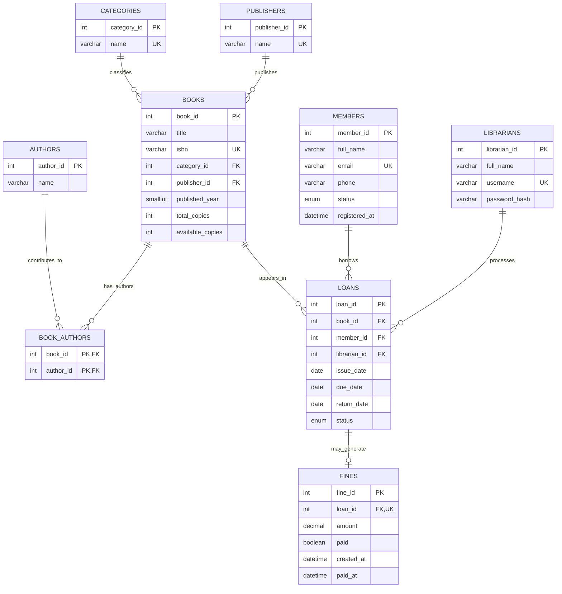

# Entity-Relationship Diagram

The `book_authors` composite primary key prevents a book-author relationship from being duplicated. Each fine is associated with at most one loan; `fines.loan_id` is unique.
