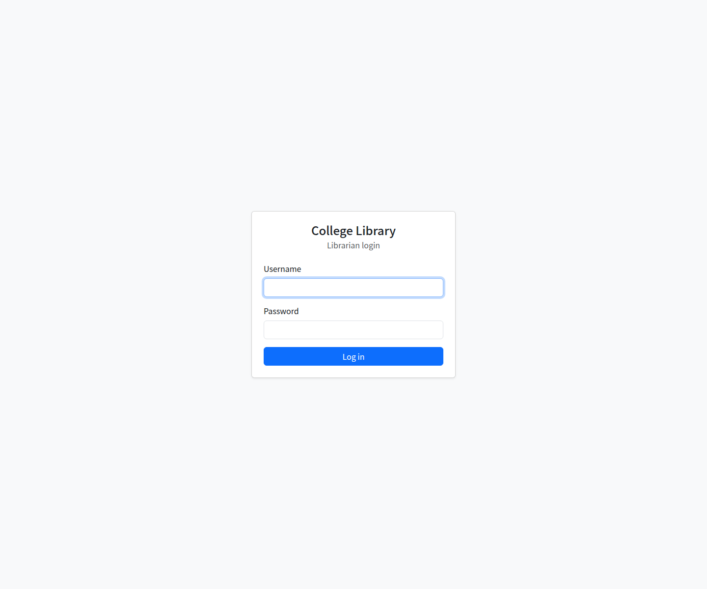

# Technical Report: College Library and Book Circulation Management System

## Submission Details

- Institution: RP Karongi College
- Course/module: Advanced Web Technology
- Group: 3
- Submission date: 01 October 2026
- Group members: Shalom K, Jose Narame, Sabin Levis, Adeline N, Augustin Mugisha, H Muhamadi

## 1. Overview

The system replaces manual circulation registers with a centralized PHP application for library staff. It manages books and their authors, publishers and categories; members and librarians; loans and returns; overdue activity; fines; and operational reports.

## 2. Users and Requirements

The primary user is a librarian. A librarian can authenticate, maintain catalog and member records, issue and return books, view member borrowing history, record fine payments, and review overdue and circulation reports.

The application rejects borrowing when a member is inactive, has unpaid fines, has reached the active-loan limit, already holds the same book, or when no copy is available. Returns cannot be repeated. Book availability is reconciled with outstanding loans when catalog stock is changed.

| Requirement area | Implemented support |
|---|---|
| Catalog | Book registration, editing, searching, availability, authors, publishers, and categories |
| Members and staff | Member registration, editing, search, history, librarian login, and librarian account management |
| Circulation | Book issue and return with availability updates and circulation-rule checks |
| Overdue and fines | Overdue identification, late-return fine calculation, outstanding-fine checks, and payment recording |
| Reporting | Overdue report, circulation summary, most-borrowed titles, availability, and fine totals |
| Error handling | Input validation, not-found and business-rule messages, safe error page, and server-side logging |

## 3. Architecture

The application uses PHP 8, server-rendered pages, PDO, and a MySQL/MariaDB database. Models separate database operations from page handlers. `Database` provides a shared PDO connection; `Book`, `Member`, `Librarian`, `Loan`, `Fine`, and the lookup models own domain operations. Shared helpers provide validation, session authentication, CSRF tokens, output escaping, flash messages, and exception handling.

See [UML class diagram](uml-class-diagram.md) and [ER diagram](er-diagram.md).

## 4. Database Design

The schema is defined in [`database.sql`](../database.sql). It contains authors, publishers, categories, books, the `book_authors` many-to-many link, members, librarians, loans, and fines. Primary and foreign keys enforce the main relationships. Unique constraints protect ISBNs, member email addresses, librarian usernames, lookup names where defined, and the one-fine-per-loan rule. Check constraints protect copy counts and loan/fine values.

## 5. Transactions and Circulation

Borrowing locks the selected book row, rechecks circulation rules, decrements availability, inserts the loan, and commits these changes together. Returning locks the loan, writes the return date, restores one copy, calculates any overdue fine, records the fine, and commits. Book edits lock the book row and calculate available copies from total copies minus copies currently on loan. Failures roll back the transaction.

## 6. Security and Error Handling

- All PHP database communication uses PDO; user-supplied values use prepared statements.
- Passwords are stored using `password_hash` and checked with `password_verify`.
- Forms that change data use CSRF tokens; pages that manage library data require a logged-in librarian.
- Input is validated in server-side model and form paths. Output is escaped before HTML rendering.
- PHP display errors are disabled. Internal failures are logged; end users receive friendly messages without SQL, stack traces, credentials, or file paths.
- Database constraints remain the final integrity boundary for relationships and uniqueness.

## 7. Testing

Run the database-backed checks with:

```sh
php tests/run-integration.php
```

The script creates uniquely named test records, exercises lookup CRUD, librarian authentication protections, book availability, borrowing, returns, overdue fines, fine payment, and relationship restrictions, then removes its fixtures. The recorded run in [test cases and results](../tests/test-cases.md) passed all six integration groups. Browser-level manual cases are listed separately and should be completed during the practical demonstration.

## 8. Setup

Follow the XAMPP instructions in [`README.md`](../README.md). Import the schema into a development database and configure the database connection as needed. The current configuration uses local-development credentials by default. Change those credentials before deployment and ensure `logs/` is writable by PHP.

**Important:** `database.sql` begins by dropping `library_db`. Back up any data before importing it.

## 9. Deliverable Status

The PHP source, database script, ER diagram, UML class diagram, technical report, integration test script, and test record are present in the project. Each student should complete and sign their section in the [individual contribution reports](contributions/individual-reports.md). The presentation itself is a group activity; an outline and demonstration sequence are provided in [presentation-outline.md](presentation-outline.md).

## 10. Conclusion

The application provides a centralized way for librarians to manage the catalog, members, loans, returns, overdue books, and fines. PDO prepared statements, database constraints, validation, and transactions support data integrity and safer error handling. The integration tests verify core model behavior. Before submission, the group should complete the pending browser-level test cases, confirm all report details, and rehearse the practical demonstration.

## Appendix A: Application Screenshots

The following screenshots are captured from the application and use the project's sample data.

### Librarian Login



### Dashboard


### Borrow Form


### Successful Borrow


### Overdue Loans


### Late Return and Fine


### Additional Screenshots to Capture

Add screenshots from the running application for the following screens if the lecturer expects visual evidence for every module:

- Book catalog search and book registration/editing.
- Member directory, registration, and borrowing history.
- Author, publisher, and category management.
- Librarian account management.
- Fine listing and payment confirmation.
- Circulation summary and overdue reports.
