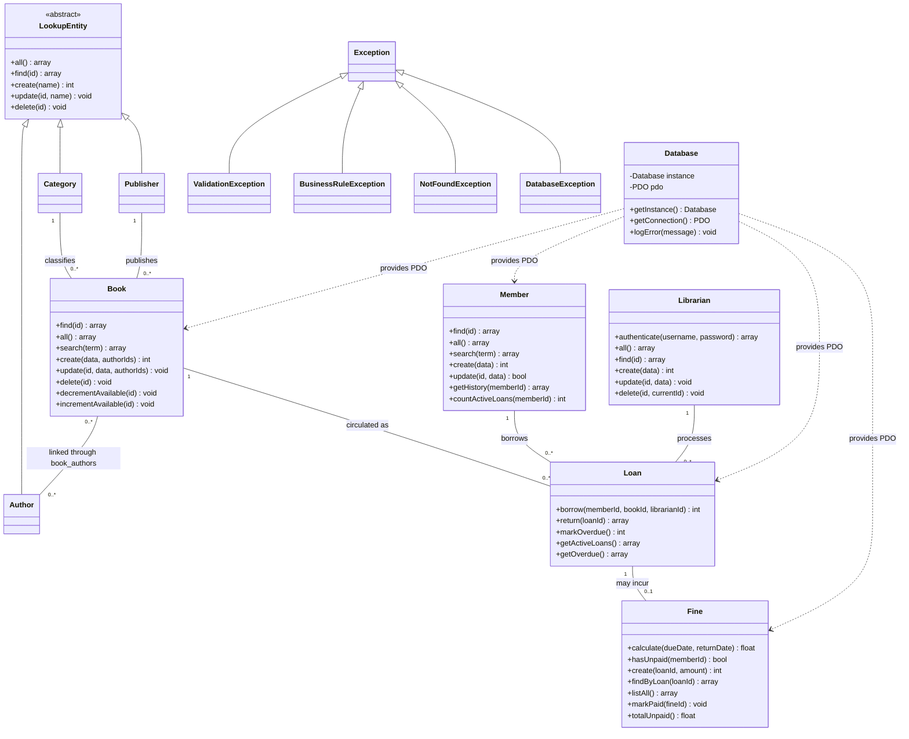

# UML Class Diagram

```mermaid
classDiagram
    class Database {
        -Database instance
        -PDO pdo
        +getInstance() Database
        +getConnection() PDO
        +logError(message) void
    }
    class LookupEntity {
        <<abstract>>
        +all() array
        +find(id) array
        +create(name) int
        +update(id, name) void
        +delete(id) void
    }
    class Author
    class Publisher
    class Category
    class Book {
        +find(id) array
        +all() array
        +search(term) array
        +create(data, authorIds) int
        +update(id, data, authorIds) void
        +delete(id) void
        +decrementAvailable(id) void
        +incrementAvailable(id) void
    }
    class Member {
        +find(id) array
        +all() array
        +search(term) array
        +create(data) int
        +update(id, data) bool
        +getHistory(memberId) array
        +countActiveLoans(memberId) int
    }
    class Librarian {
        +authenticate(username, password) array
        +all() array
        +find(id) array
        +create(data) int
        +update(id, data) void
        +delete(id, currentId) void
    }
    class Loan {
        +borrow(memberId, bookId, librarianId) int
        +return(loanId) array
        +markOverdue() int
        +getActiveLoans() array
        +getOverdue() array
    }
    class Fine {
        +calculate(dueDate, returnDate) float
        +hasUnpaid(memberId) bool
        +create(loanId, amount) int
        +findByLoan(loanId) array
        +listAll() array
        +markPaid(fineId) void
        +totalUnpaid() float
    }
    class ValidationException
    class BusinessRuleException
    class NotFoundException
    class DatabaseException

    LookupEntity <|-- Author
    LookupEntity <|-- Publisher
    LookupEntity <|-- Category
    Book "0..*" -- "0..*" Author : linked through book_authors
    Category "1" -- "0..*" Book : classifies
    Publisher "1" -- "0..*" Book : publishes
    Book "1" -- "0..*" Loan : circulated as
    Member "1" -- "0..*" Loan : borrows
    Librarian "1" -- "0..*" Loan : processes
    Loan "1" -- "0..1" Fine : may incur
    Database ..> Book : provides PDO
    Database ..> Member : provides PDO
    Database ..> Loan : provides PDO
    Database ..> Fine : provides PDO
    Exception <|-- ValidationException
    Exception <|-- BusinessRuleException
    Exception <|-- NotFoundException
    Exception <|-- DatabaseException
```
